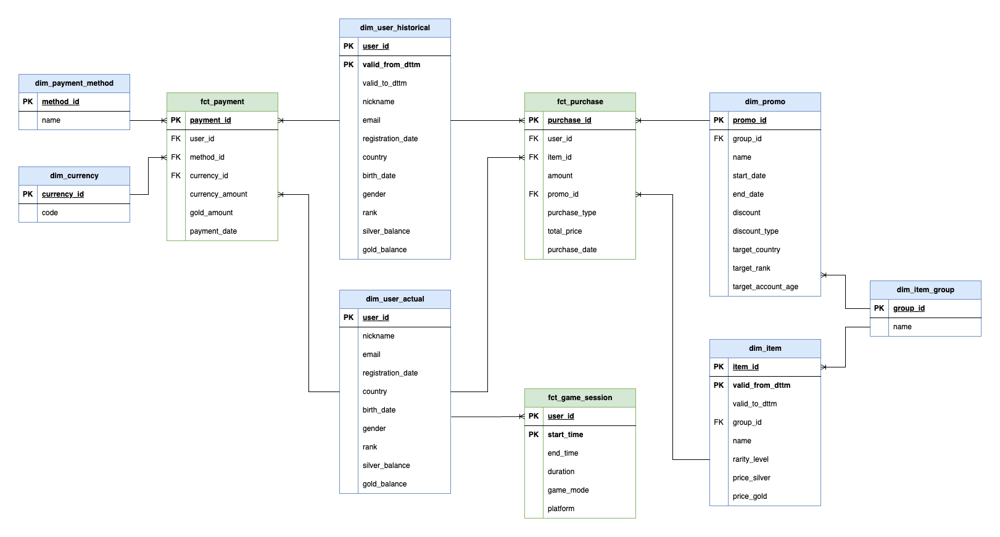

# Проект: DWH для онлайн-игры

## Цель проекта
Построение аналитического хранилища данных (DWH) для онлайн-игры, которое позволит анализировать поведение игроков, их покупки и эффективность рекламных акций.

## Описание предметной области

Проект моделирует предметную область онлайн-игры. Игроки могут совершать покупки в игре, используя внутриигровую валюту. Внутриигровая валюта бывает двух видов: серебро и золото. Серебро можно зарабатывать в игре, а золото можно купить только за реальные деньги. Игроки могут использовать как серебро, так и золото для покупки различных предметов в игре. Некоторые вещи можно купить только за золото, а некоторые - только за серебро. Также есть предметы, которые можно купить за обе валюты. Кроме того, в игре проводятся рекламные акции, которые могут предоставлять скидки определённым категориям игроков.

## Сущности и их атрибуты

### Игроки (пользователи) - `User`
- `user_id` - уникальный идентификатор пользователя (PK)
- `nickname` - имя игрока (никнейм)
- `email` - электронная почта
- `registration_date` - дата регистрации пользователя
- `country` - страна игрока
- `birth_date` - дата рождения игрока
- `gender` - пол игрока (мужской/женский)
- `rank` - уровень игрока в игре (числовое значение)
- `silver_balance` - баланс серебра
- `gold_balance` - баланс золота

### Игровые сессии пользователей - `GameSession`
- `user_id` - идентификатор пользователя (PK)
- `start_time` - дата и время начала сессии (PK)
- `end_time` - дата и время окончания сессии (может быть NULL, если сессия ещё не закончилась)
- `duration` - продолжительность сессии (в минутах)
- `game_mode` - режим игры (PvE / PvP)
- `platform` - платформа (mobile / desktop / console)

### Предметы (товары) - `Item`
- `item_id` - уникальный идентификатор предмета (PK)
- `group_id` - идентификатор группы предметов (FK)
- `name` - название предмета
- `rarity_level` - уровень редкости (обычный, редкий, эпический, легендарный)
- `price_silver` - цена в серебре (может быть NULL, если предмет нельзя купить за серебро)
- `price_gold` - цена в золоте (может быть NULL, если предмет нельзя купить за золото)

### Группы предметов - `ItemGroup`
- `group_id` - уникальный идентификатор группы предметов (PK)
- `name` - название группы предметов (например, оружие, броня, заклинание, скин и т.д.)

### Промоакция (скидки) - `Promo`
- `promo_id` - уникальный идентификатор промоакции (PK)
- `group_id` - идентификатор группы предметов (FK)
- `name` - название промоакции
- `start_date` - дата начала промоакции
- `end_date` - дата окончания промоакции
- `discount` - размер скидки (в процентах)
- `discount_type` - тип скидки (на серебро, на золото, на оба типа)
- `target_country` - целевая страна (может быть NULL, если акция действует для всех стран)
- `target_rank` - минимальный ранг игрока для участия в акции (может быть NULL, если акция доступна всем)
- `target_account_age` - минимальный "возраст" аккаунта для участия в акции (в днях, может быть NULL, если акция доступна всем). Определяется по разнице между текущей датой и `registration_date` игрока.

### Покупки (за внутриигровую валюту) - `Purchase`
- `purchase_id` - уникальный идентификатор покупки (PK)
- `user_id` - идентификатор пользователя (FK)
- `item_id` - идентификатор предмета (FK)
- `amount` - количество предметов, купленных в одной покупке
- `promo_id` - идентификатор промоакции (FK, может быть NULL, если покупка не попадает под акцию)
- `purchase_type` - тип покупки (silver / gold)
- `total_price` - общая стоимость покупки (в серебре или золоте, в зависимости от `purchase_type`)
- `purchase_date` - дата и время покупки

### Платежи (внесение реальных денег игроком) - `Payment`
- `payment_id` - уникальный идентификатор платежа (PK)
- `user_id` - идентификатор пользователя (FK)
- `method_id` - способ оплаты (FK)
- `currency_id` - валюта платежа (FK)
- `currency_amount` - сумма платежа (в реальных деньгах)
- `gold_amount` - количество золота, полученного за платеж
- `payment_date` - дата и время платежа

### Способы оплаты - `PaymentMethod`
- `method_id` - уникальный идентификатор способа оплаты (PK)
- `name` - название способа оплаты (например, Visa, MasterCard, PayPal и т.д.)

### Валюта - `Currency`
- `currency_id` - уникальный идентификатор валюты (PK)
- `code` - код валюты (например, USD, EUR, RUB и т.д.)

## Примеры бизнес-процессов
1. Игрок заходит в игру и начинает игровую сессию.
2. Игрок совершает покупку, используя внутриигровую валюту (серебро или золото).
3. Игрок вносит реальные деньги в игру, получая за это внутриигровую валюту (золото).

## Возможности для аналитики
- Выручка по регионам, времени, устройствам.
- Анализ популярности предметов и групп товаров.
- Эффективность промоакций и их влияние на конверсию.
- Анализ поведение игроков (игровые сессии, покупки, платежи).
- Разделение покупок по источнику: серебро или золото.
- Сегментация игроков по активности и платежеспособности.
- Сравнение монетизации разных игровых режимов.
- Сезонные тренды активности и платежей.

## Многомерное моделирование по Кимбаллу (факты/измерения)

